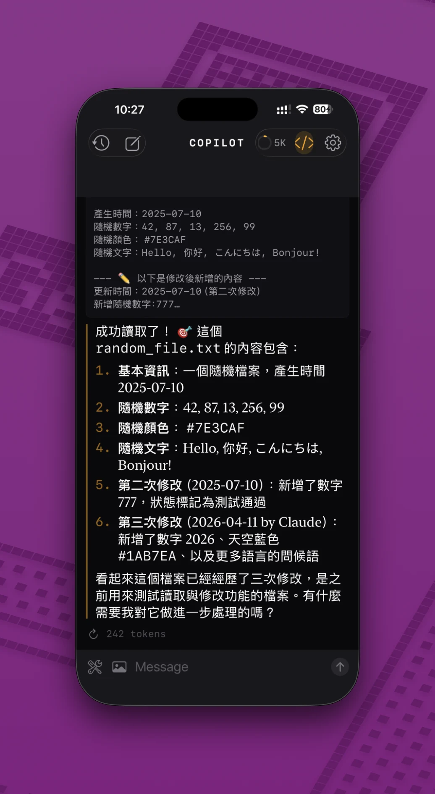

# CopilotChat for iOS

<p align="center">
  
</p>

[中文](./README-TW.md)

A native iOS multi-provider LLM chat client. Pure SwiftUI, zero third-party dependencies.

Combines GitHub Copilot, 120+ providers, MCP tool auto-execution, and an on-device workspace coding mode in a single native app.

## Features

### Multi-Provider

Based on [models.dev](https://models.dev), supporting 120+ providers:

- **GitHub Copilot** — Device Flow OAuth, dual Chat Completions + Responses API paths
- **Augment Code** — Session JSON auth, NDJSON streaming, tenant-based architecture
- **OpenAI Compatible** — Z.AI, Zhipu, Alibaba, Tencent, xAI, Groq, OpenRouter, and 80+ more
- **Anthropic Compatible** — Direct Anthropic API
- **Gemini** — Google AI Studio (API key via HTTP header)
- **OpenAI Codex** — Codex CLI endpoint (PKCE OAuth)

Each provider has its own auth flow, streaming protocol (SSE / NDJSON), and thinking/reasoning token handling. Switching providers auto-remembers the last selected model per provider.

### MCP Tool Auto-Execution

- MCP (Model Context Protocol) Streamable HTTP transport
- Multi-server management (headers stored securely in Keychain)
- Automatic tool call execution (up to 10-round completion loop)
- Three-tier permission control (tool > server > session)
- `tool_search` — deferred loading; the model loads MCP tools on demand

### Built-in Tools

- `web_fetch` — fetch web content (WKWebView, non-persistent session)
- `web_screenshot` — webpage screenshots (supports vision models)
- `brave_web_search` — Brave Search (API key in Keychain)
- `tool_search` — MCP tool discovery (auto-injected in deferred loading mode)
- `switch_mode` — chat / coding mode coordinator
- **File Operations** (workspace, iOS sandbox):
  - `list_files` — directory listing with recursive mode, skips `.git`/`build`/`node_modules`
  - `read_file` — file contents with line numbers, offset/limit pagination, 10MB size guard
  - `write_file` — write/overwrite file, auto-creates parent directories
  - `edit_file` — precise search-and-replace (single or all matches), shows line delta
  - `create_file` — create file with optional initial content, auto-creates parent directories
  - `delete_file` — delete file or empty directory
  - `copy_file` — copy file or directory, auto-creates parent directories
  - `move_file` — move/rename file or directory, supports move-into-directory semantics
  - `grep_files` — regex content search with context lines, file filtering, binary detection, match summary

### Coding Mode

- Dual chat / coding mode UI
- Coding mode uses a coordinator flow: the model calls `switch_mode` first, then uses file tools
- Select project folder via iOS Folder Picker
- Security-scoped bookmarks persist workspace access across app launches
- Mode-aware tool filtering: chat mode doesn't expose coding-only tools

### Community Plugins (.cex)

- JavaScriptCore sandbox plugin system
- Users import `.cex` plugin bundles (`manifest.json` + `index.js`) via the Files app
- Controlled API access: network (domain whitelist), clipboard, notifications, openURL
- Available in both Chat and Coding modes
- Sample plugin: `plugins/github-cex/` (GitHub REST API tools)

### Conversation Management

- JSON file persistence for conversation history (`Documents/Conversations/`)
- Auto-compaction (summarization triggered at 95% context window)
- Context window ring indicator (token usage in nav bar)
- Auto-naming conversations
- Edit messages / regenerate responses

### Design

- Carbon design system (deep charcoal + amber #F59E0B)
- Triple typeface (New York serif / SF Mono monospace / SF Pro sans-serif)
- Thinking / reasoning block display (adapts to each provider's field names)

### Security

- All tokens and API keys stored in Keychain (`kSecAttrAccessibleAfterFirstUnlock`)
- MCP server headers stored in Keychain (never UserDefaults)
- Full HTTPS, no ATS exceptions
- Gemini API key sent via HTTP header (never exposed in URL)
- Zero third-party dependencies — no supply chain risk

## Requirements

- iOS 26+
- Xcode 26+
- A GitHub account (with Copilot subscription) or any supported provider API key

## Installation

### 1. Open the project

```bash
open CopilotChat.xcodeproj
```

### 2. Configure signing

1. Select the **CopilotChat** target in Xcode
2. Go to **Signing & Capabilities**
3. Choose your **Development Team** (Personal Team works)
4. If the Bundle Identifier conflicts, change it to something unique (e.g. `com.yourname.copilotchat`)

### 3. Install to device

1. Connect your iPhone/iPad via USB
2. Select your device in Xcode's toolbar
3. Press **Cmd + R** to build and install
4. On first install, go to: **Settings → General → VPN & Device Management** → trust the developer

## Usage

### Sign in

**GitHub Copilot:**

1. Open the app → tap the gear icon → **Settings**
2. Tap **Sign in with GitHub**
3. The app displays a verification code and a GitHub link
4. Open the link in a browser, enter the code
5. The app completes sign-in automatically after authorization

**Augment Code:**

Select the Augment provider in Settings and paste your Session JSON (containing tenant URL and API key).

**Other Providers:**

Select a provider in Settings and enter your API key. All providers from models.dev are supported.

### Chat

After signing in, type in the input field and press send. The default model is `claude-sonnet-4-6`, changeable in Settings.

### Coding Mode / Workspace

1. Tap the mode icon in the nav bar to switch to coding mode
2. On the empty state, tap **Choose Folder** to select a project folder
3. The model can discover available tools via `tool_search`
4. File edits prefer `edit_file` (precise replace / patch-style editing)
5. To switch projects, return to the coding mode empty state and tap **Change Folder**



### Setting up an MCP Server

1. Go to **Settings → MCP Servers → Add MCP Server**
2. Fill in:
   - **Name**: Display name (e.g. `memory-connect`)
   - **URL**: Server endpoint (e.g. `https://your-worker.workers.dev/mcp`)
   - **Headers**: Auth headers, one per line (e.g. `Authorization: Bearer your-token`)
3. After saving, the app connects automatically and loads tools

MCP tools are injected into the API `tools` parameter. When the AI responds with a tool call, the app executes it through the MCP server and returns the result — no manual intervention needed.

Built-in file tools don't go through MCP servers; they execute directly within the app via workspace permissions.

### Community Plugins

1. Download a `.cex` plugin bundle (a folder containing `manifest.json` and `index.js`)
2. Go to **Settings → Plugins → Community Plugins → Import from Files...**
3. Select the plugin folder
4. The plugin loads and its tools become available in both chat and coding modes

## Auth Flows

| Provider | Auth Method |
|----------|-------------|
| GitHub Copilot | Device Flow OAuth (standalone OAuth Client ID) |
| Augment Code | Session JSON (tenant URL + API key) |
| OpenAI Codex | PKCE OAuth (Authorization Code Flow) |
| Others | API key (stored in Keychain) |

## Technical Architecture

- **Swift 6** strict concurrency
- **@Observable** macro (Observation framework)
- **URLSession async/await** + `bytes(for:)` SSE / NDJSON streaming
- **Keychain** for all credential storage
- **MCP Streamable HTTP** transport (JSON-RPC over HTTP)
- **JavaScriptCore** sandbox for community plugins
- **XcodeGen** for project structure management
- **Zero third-party dependencies**

## Project Structure

```
CopilotChat/
├── CopilotChatApp.swift              # App entry point
├── ContentView.swift                 # Root view
├── DesignSystem.swift                # Carbon design system
├── Models/
│   ├── AuthManager.swift             # GitHub Device Flow OAuth
│   ├── CExtPlugin.swift              # .cex plugin wrapper
│   ├── CExtPluginManager.swift       # Community plugin manager
│   ├── ChatModels.swift              # Data models (messages, API types)
│   ├── Conversation.swift            # Conversation model
│   ├── ConversationStore.swift       # Conversation history persistence
│   ├── CopilotService.swift          # Chat Completions API + SSE
│   ├── FileSystemPlugin.swift        # Coding mode file tools + workspace access
│   ├── GitHubPlugin.swift            # Built-in GitHub tools
│   ├── JavaScriptCorePluginLoader.swift # JSContext sandbox loader
│   ├── MCPClient.swift               # MCP JSON-RPC client
│   ├── MarkdownParser.swift          # Markdown parser
│   ├── PluginSystem.swift            # Built-in plugin / tool registry
│   ├── SettingsStore.swift           # Settings persistence
│   └── WebFetchService.swift         # Web fetch service
├── Providers/
│   ├── LLMProvider.swift             # Provider protocol
│   ├── CopilotProvider.swift         # GitHub Copilot
│   ├── AugmentProvider.swift         # Augment Code (NDJSON streaming)
│   ├── OpenAICompatibleProvider.swift # Z.AI, OpenRouter, etc.
│   ├── AnthropicCompatibleProvider.swift # Direct Anthropic
│   ├── GeminiProvider.swift          # Google Gemini
│   ├── OpenAICodexProvider.swift     # OpenAI Codex (PKCE OAuth)
│   ├── ProviderRegistry.swift        # Provider registration and routing
│   ├── ProviderTransform.swift       # Provider transforms
│   ├── ModelsDev.swift               # models.dev data
│   └── SSEParser.swift               # SSE stream parser
├── Views/
│   ├── CExtPluginsView.swift         # Community plugin management UI
│   ├── ChatView.swift                # Chat interface
│   ├── ConversationHistoryView.swift # Conversation history
│   ├── MessageView.swift             # Message rendering
│   ├── MarkdownView.swift            # Markdown renderer
│   ├── MCPSettingsView.swift         # MCP server management
│   ├── ModelPickerView.swift         # Model picker
│   ├── SettingsView.swift            # Settings page
│   └── WorkspaceSelectorView.swift   # Project folder picker UI
├── Agents/
│   └── AgentConfig.swift             # Agent configuration
├── Utilities/
│   └── KeychainHelper.swift          # Keychain wrapper
└── plugins/
    └── github-cex/                   # Sample .cex plugin (GitHub API)
```

## Related Documents

- [`docs/zai-glm51-tool-calling-investigation.md`](docs/zai-glm51-tool-calling-investigation.md) — Z.AI GLM-5.1 tool calling identity drift investigation report

## Regenerating the Xcode Project

If you modify `project.yml`:

```bash
brew install xcodegen  # Install XcodeGen if needed
xcodegen generate
```

## Acknowledgments

The community plugin system (.cex) was inspired by [OpenCode](https://github.com/anomalyco/opencode)'s plugin architecture.

## License

MIT
